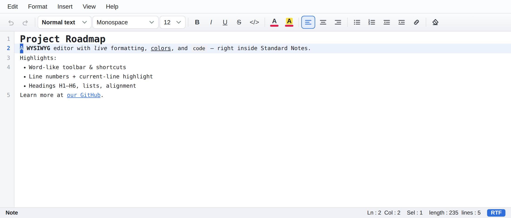

<div align="center">


# RichNote

### The rich‑text editor Standard Notes was missing.

A fast, beautiful **WYSIWYG editor** for [Standard Notes](https://standardnotes.com) — write with **live formatting**, a **Word‑like toolbar**, headings, colors, lists, line numbers and keyboard shortcuts. No Markdown syntax to remember. What you see is what you get.


-success)




</div>

---

## ✨ Why you'll love it

- 🪄 **True WYSIWYG** — bold looks bold, links look like links. No raw `**markdown**`.
- 🧰 **Word‑like toolbar** — style dropdown (Normal / **H1–H6** / Quote), font, size, **B / I / U / S**, inline code, and more, all on **one clean line**.
- ⚡ **Markdown auto‑format** — type `# `, `- `, `1. `, `> `, `[] ` then space, or `---` then Enter, and the line becomes a heading / list / quote / **checklist** / divider instantly.
- 🖼️ **Images** — **paste** or **drag‑and‑drop** a picture; it's embedded in the note (offline‑safe, no hotlinks). **Click to select**, **drag the corner to resize**, `Delete` to remove.
- 🧑‍💻 **Edit the HTML source** — toggle **View → HTML source** (or the `</>` toolbar button) to edit the raw HTML directly: **pretty‑printed** and **syntax‑highlighted**, not one minified line.
- 🧱 **Code blocks** — fenced blocks with **language syntax highlighting** and a one‑click copy button.
- ☑️ **Checklists** — tick‑off task lists; click the box to mark done.
- 🧮 **Line tools** — duplicate (`Ctrl+Shift+D`), move (`Alt+↑/↓`) and delete (`Ctrl+Shift+K`) lines like VS Code.
- 🔗 **Auto‑link URLs** — paste or type a link and it turns clickable automatically.
- 🎨 **Text & highlight colors** — a **Google‑Sheets‑style palette** plus any custom color.
- 🔢 **Line numbers + current‑line highlight** — a code‑editor feel for your notes.
- 🗺️ **Minimap** — a VS Code‑style overview on the right; click or drag to jump anywhere. Toggle in **View → Minimap**.
- ↩️ **Reliable undo/redo** — a whole multi‑line indent, paste or source edit undoes in **one step** (`Ctrl+Z` / `Ctrl+Y`).
- ⌨️ **Keyboard shortcuts everyone knows** — `Ctrl+B/I/U`, `Ctrl+Alt+1…6` for headings, `Ctrl+L/E/R` to align, `Ctrl+K` for links, `F4` to repeat the last action.
- 🔗 **Smart links** — insert/edit with a popup; **Ctrl/Cmd‑click** to open.
- 🧬 **Multiple cursors (Sublime‑style)** — `Shift+Alt+↑/↓` to add a caret above/below, **Alt‑click** to drop one anywhere, then type / delete / arrow‑select on every line at once.
- 🔍 **Find & Replace (`Ctrl+F` / `Ctrl+H`)** — jump between matches with **Match case / Whole word / Regex** options, and **“Select all”** (`Alt+Enter`) to turn every match into a caret and edit them together.
- 📊 **Live status bar** — word / character / line counts plus a **Saved / Saving…** indicator.
- ↹ **Tab indentation** (single line or a whole block) and a **Word Wrap** toggle.
- ♿ **Accessible** — keyboard focus rings, ARIA labels on every control, and screen‑reader‑friendly markup.
- 🌗 **Clean light theme**, thoughtfully designed and responsive.
- 🔒 **Private by design** — 100% local, static HTML/CSS/JS. No trackers, no network calls, no build step.

> Your notes stay yours. The editor runs entirely inside Standard Notes' sandbox.

---

## 🚀 Install in 30 seconds

Standard Notes loads editors from a URL. Just import one of the manifests below.

1. Open **Standard Notes** → **Preferences / Settings → Plugins (or Extensions) → Import Extension**.
2. Paste **one** of these links and confirm:

   **🌐 Online (recommended) — runs straight from GitHub Pages, no download, always the latest:**

   ```
   https://nguyenhuuducit91.github.io/RichNote/ext.online.json
   ```

   **📦 Packaged — installs a bundled copy from `RichNote.zip` (works offline):**

   ```
   https://nguyenhuuducit91.github.io/RichNote/ext.json
   ```

3. Open any note → click the **editor switcher** → choose **RichNote**. Done! 🎉

> The **online** manifest's `download_url` points at the hosted `index.html` (not a zip),
> so Standard Notes runs the editor straight from GitHub Pages — nothing to package or
> update locally. The **packaged** manifest instead points to `RichNote.zip` for an
> offline/local install.

> Custom editors may require a Standard Notes plan that supports extensions, or the self‑hosted / desktop app.

### ⭐ Make RichNote the default note type

So every **new** note opens in RichNote automatically:

- **Per note:** open a note → click the **note‑type / editor switcher** (the editor icon in the note's toolbar) → pick **RichNote**. In that same list, open the **⋯ menu** next to RichNote (or the item's options) and choose **“Make Default”**.
- **Or globally:** **Preferences / Settings → General → Default note type** → select **RichNote**.

New notes will now use RichNote out of the box. Existing notes keep their current editor until you switch them individually.

> Wording varies slightly by Standard Notes version (desktop / web / mobile), but the option always lives in the note's **editor switcher** or **Preferences → General**.

---

## ⌨️ Keyboard shortcuts

| Shortcut | Action | Shortcut | Action |
|---|---|---|---|
| `Ctrl+Z` / `Ctrl+Y` | Undo / Redo | `Ctrl+B / I / U` | Bold / Italic / Underline |
| `Ctrl+Shift+X` | Strikethrough | `Ctrl+Alt+1…6` | Heading 1–6 |
| `Ctrl+Alt+0` | Normal text | `Ctrl+L / E / R` | Align left / center / right |
| `Ctrl+Shift+8 / 7` | Bulleted / Numbered list | `Ctrl+K` | Insert link |
| `Tab` / `Shift+Tab` | Indent / Outdent | `Ctrl+\` | Clear formatting |
| `Ctrl+H` | Find & Replace | `F4` | **Repeat last format** |
| `Ctrl+Shift+D` | Duplicate line | `Ctrl+Shift+K` | Delete line |
| `Alt+↑ / ↓` | Move line up / down | `--- ⏎` | Horizontal rule |
| `Enter` / `Shift+Enter` | New line (new block) | `[ ] ␣` | Checklist |
| `Shift+Alt+↑ / ↓` | Add cursor above / below | `Alt+Click` | Add / remove a cursor |
| `Ctrl+F` | Find | `Alt+Enter` | Select all matches (multi‑cursor) |
| `↑ ↓ ← →` (with cursors) | Move every cursor | `Shift+↑↓←→ / Home / End` | Select at every cursor |
| `Ctrl+Shift+.` | Increase font size | `Ctrl+Shift+,` | Decrease font size |
| `Ctrl+Shift+V` | Paste value only (plain) | | |
| `Esc` | Collapse to one cursor | | |

`Ctrl` = `Cmd` on macOS.

**Images:** paste or drag a picture in → **click** it to select → **drag the corner** to resize → `Delete` to remove.
**HTML source:** **View → HTML source** or the `</>` toolbar button; edit the raw HTML and press `Esc` (or toggle again) to return.

---

## 💛 Support the developer

RichNote is **free and open‑source**. If it makes your notes nicer, please consider buying me a coffee — it directly funds new features and fixes. 🙏

<div align="center">

<table>
<tr>
<td align="center"><br/><b>Bank</b></td>
<td align="center"><br/><b>PayPal</b></td>
</tr>
</table>

**Scan to donate** · Nguyễn Hữu Đức

</div>

You can also support by ⭐ **starring the repo** and sharing it with fellow Standard Notes users!

---

## 👤 Author

**Nguyễn Hữu Đức** — Software Developer @ **VIETIS**

- 📧 Email: [nguyenhuuduc.it.91@gmail.com](mailto:nguyenhuuduc.it.91@gmail.com)
- 📱 Phone/Zalo: **0964 589 910**

Found a bug or have an idea? [Open an issue](https://github.com/nguyenhuuducit91/RichNote/issues) or reach out — feedback is always welcome.

---

## 🗂️ Project structure

```
RichNote/
├── ext.json                  # Component manifest — packaged (bundles RichNote.zip)
├── ext.online.json           # Component manifest — online only (hosted, no zip)
├── ext.dev.json              # DEV manifest — loads from http://localhost:8080
├── index.html                # Editor page (menu, toolbar, WYSIWYG area, HTML source view)
├── styles/editor.css         # All styling (light theme, toolbar, dialogs, images)
├── js/editor.js              # Editor logic + ComponentRelay integration
├── js/multicursor.js         # Multi-cursor & Find (Sublime-style)
├── js/minimap.js             # VS Code-style minimap
├── vendor/component-relay.js # Standard Notes bridge library
├── vendor/highlight.min.js   # Syntax highlighting (code blocks + HTML source)
├── img/                      # Screenshot + donate QR
└── LICENSE                   # MIT
```

## 🛠️ Tech

Plain **HTML / CSS / JavaScript** — no framework, no build. Formatting is powered by the browser's `contenteditable`, with [highlight.js](https://highlightjs.org/) for code‑block & HTML‑source syntax colours and the official [`@standardnotes/component-relay`](https://www.npmjs.com/package/@standardnotes/component-relay) bridge for reading/saving the note.

---

<div align="center">

Made with ♥ in Vietnam · MIT License · © 2026 Nguyễn Hữu Đức

**If this saved you time, a ⭐ and a ☕ go a long way!**

</div>
